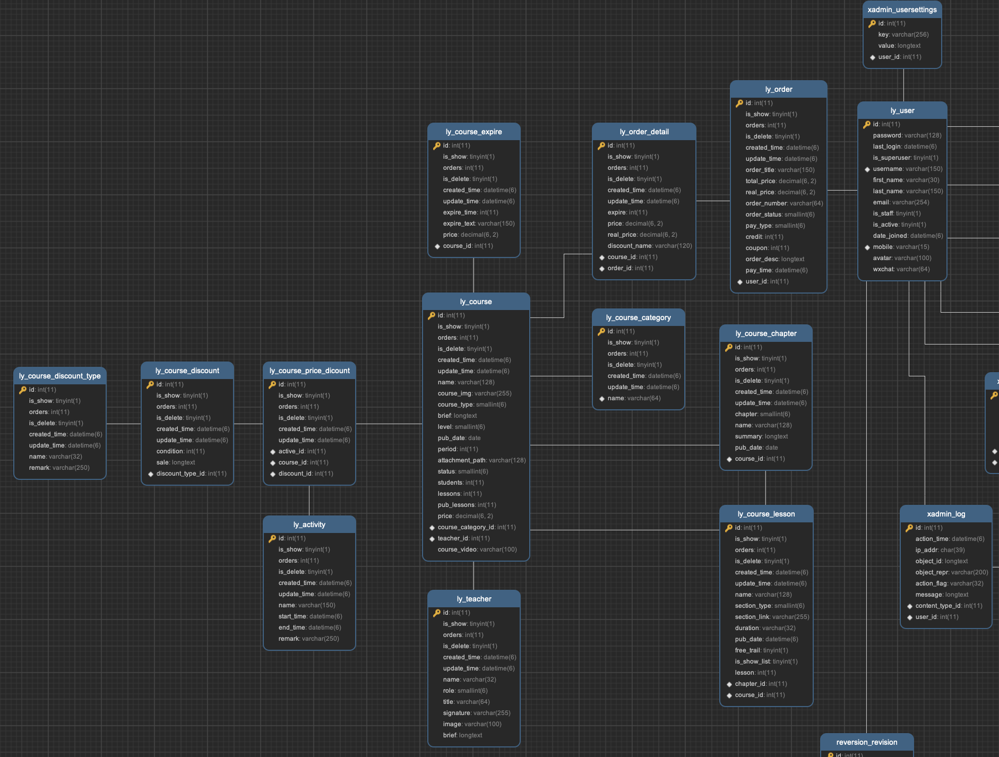

# 依赖安装
具体的环境配置键[总体环境配置](https://blog.csdn.net/weixin_42065178/article/details/124162072)，一些开发过程中额外使用的包，安装方法以及对应讲解如下：  
前端：
- [element-ui](https://blog.csdn.net/weixin_42065178/article/details/124162072)
npm install element-ui 

- [全局变量](https://blog.csdn.net/weixin_42065178/article/details/124266088)
npm install vuex

- [视频播放器](https://blog.csdn.net/weixin_42065178/article/details/124261404)
npm install vue-video-player
------
后端：
- [富文本编辑器](https://blog.csdn.net/weixin_42065178/article/details/124259501)
pip install ckeditor

- [分类过滤器](https://blog.csdn.net/weixin_42065178/article/details/124258677)
pip install django-filter

- [跨域访问](https://blog.csdn.net/weixin_42065178/article/details/124183116)
pip install django-cors-headers

- [后台管理Xadmin](https://blog.csdn.net/weixin_42065178/article/details/124186430)
pip install https://codeload.github.com/sshwsfc/xadmin/zip/django2 

- [认证JWT](https://blog.csdn.net/weixin_42065178/article/details/124205515)
pip install djangorestframework-jwt

- [缓存数据库redis](https://blog.csdn.net/weixin_42065178/article/details/124224353)
pip install django-redis

- [异步celery](https://blog.csdn.net/weixin_42065178/article/details/124231326)
pip install celery

- [支付宝支付](https://blog.csdn.net/weixin_42065178/article/details/124406593)
pip install python-alipay-sdk --upgrade

- [uswgi](https://blog.csdn.net/weixin_42065178/article/details/124418986)
pip install uswgi
------
# 数据库设计

主要表设计如下，图由navicat生成：

---
# 项目运行
**前端**：
- 在/luffy_pc目录下，使用
> npm install. 
> npm run dev
------
**后端**：
1. 数据迁移，在/luffyapi目录下，使用
> python manage.py makemigrations  
> python manage.py migrate   

2. 在/luffyapi目录下，创建超级用户，可登录xadmin
> python manage.py createsuperuser

3. 在/luffyapi目录下，运行项目
> python manage.py runserver
------
# 专栏分析地址
[https://blog.csdn.net/weixin_42065178/category_11755816.html](https://blog.csdn.net/weixin_42065178/category_11755816.html)
，如有不正确的地方，欢迎讨论。代码阅读方式建议：可以去[https://github.com/Wanncye/vue-django-luffy/network](https://github.com/Wanncye/vue-django-luffy/network)commit网络图那里看进度，看一看每次提交都改了什么内容，以及commit的信息。
